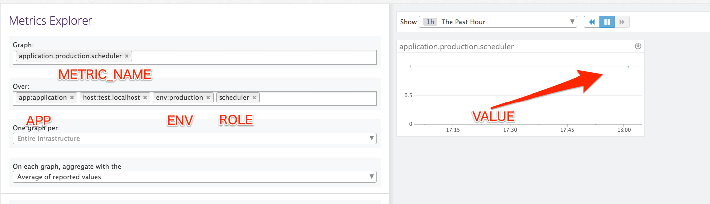

# sendog



## Usage

```bash
$ cp .env.sample .env
$ vim .env # Fix setup
$ docker run --rm --name sendog -h %H --env-file=.env koudaiii/sendog
or
$ docker run --rm --name sendog -h %H -e DATADOG_API_KEY=xxxxx -e VALUE=1 -e APP=application -e ENV=production -e ROLE=scheduler -e METRIC_NAME=scheduler.service.enabled koudaiii/sendog
```

## Configuration

* DATADOG_API_KEY datadog api token
* VALUE metrics value
* APP is value of app tag key.
* ENV value of env tag key.
* ROLE tag name.

## Development

```bash
$ cp .env.sample .env
$ vim .env # Fix setup
$ bundle install
$ bundle exec ruby sendog.rb
```
